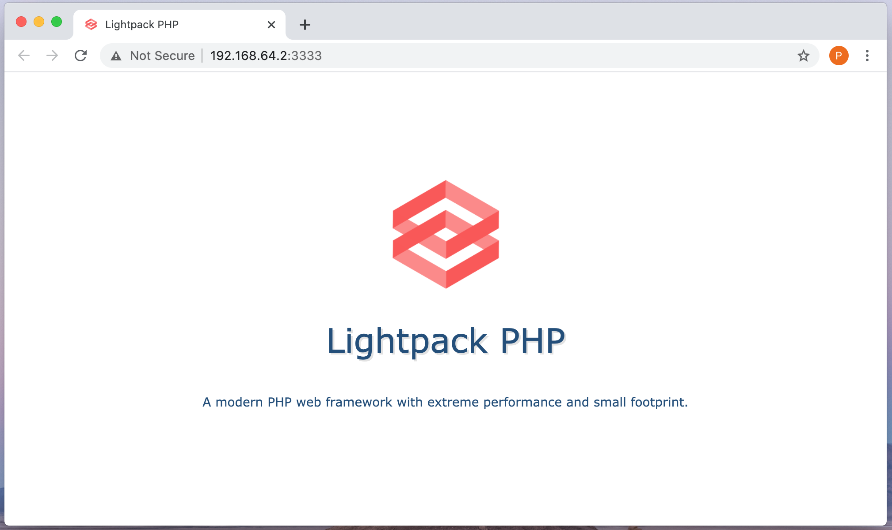
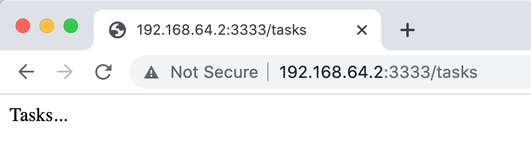
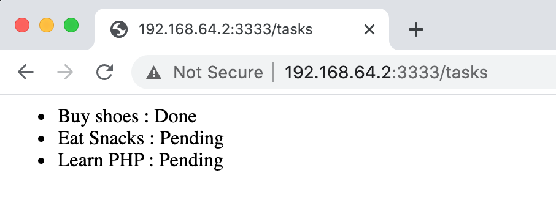
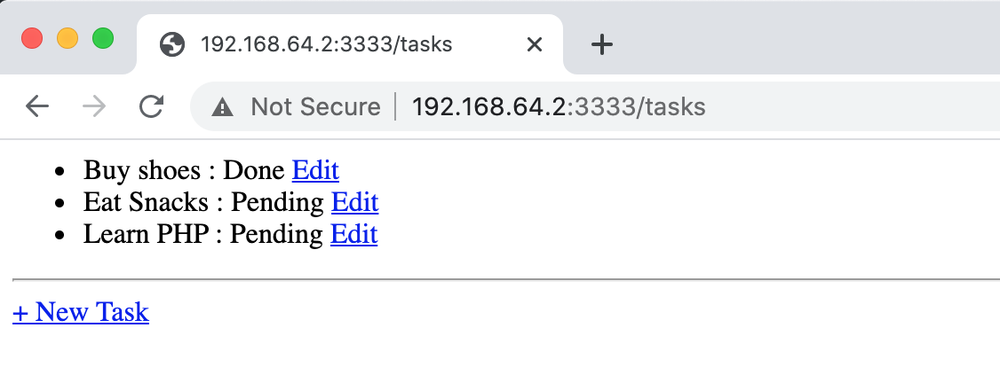
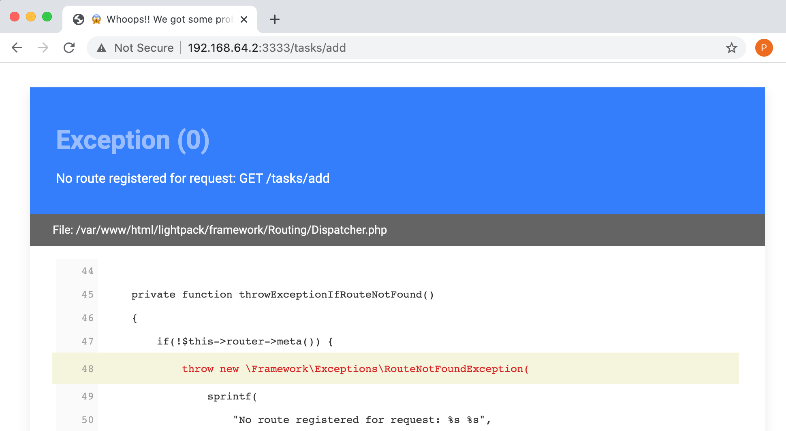
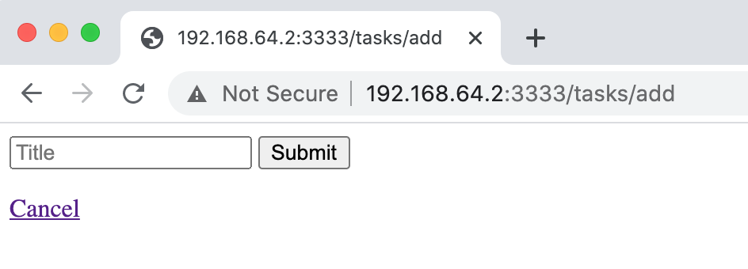
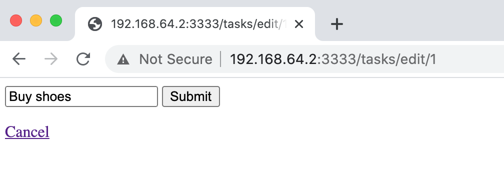
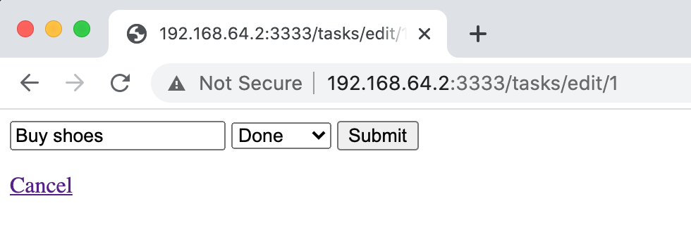

# Sample Tutorial

In this tutorial, we are going to build a simple **tasks** application. The purpose of this
tutorial is to give you a quick introduction of working with `Lightpack PHP` framework. This tutorial will not include working with advanced features like **containers**, **logging**, **filters**, **events**, **validation**, **commands**, **layouts** etc. 

It will be simple enough to get you a taste of this framework with a simple task management app.

> [Browse tutorial repository link here.](https://github.com/lightpack/taskapp)

<p class="tip">Note: This tutorial has been tested on an <b>Ubuntu</b> dev server running <b>Apache</b>.</p>


So let's get started.

## Create Project

Installing `Lightpack` is dead simple. Just clone the framework's GitHub repository in your
server root.

```bash
git clone https://github.com/lightpack/lightpack.git
```

Move into your repository folder.

```bash
cd lightpack
```

Now run `composer` to install the project's dependencies.

```bash
composer install --no-dev -vvv
```            

## Running The App

<p class="tip">You need to configure your server to serve this application from <code>public</code> folder as web root.</p>

But for local development you can run PHP's built-in web server. For that move to `public` folder inside your project and fire this command from terminal.

```bash
php -S 127.0.0.1:8080
```

Please change the **IP adress** and **Port** as per your dev machine.

Now you should see this screen below.



## Listing Tasks

We first need to define a route for `GET /tasks` in `config/routes.php` file. There you will already find a route registered for `GET /` homepage. 

### Adding /tasks route

Add a new route for **tasks** in `config/routes.php` file.

```php
$route->get('/tasks', TaskController::class);
```

We have registered `/tasks` route specifying default method `index` of controller class `TaskController`. So we now need to define our controller.

### Defining tasks controller

Inside your project root, from your terminal fire this command:

```terminal
php lucy create:controller TaskController
```
This should have created `TaskController` inside `app/Controllers` folder. Update `TaskController` with 
following code contents. 

```php
<?php

namespace App\Controllers;

class TaskController
{
    public function index()
    {
        echo 'Tasks...';
    }
}
```

Now if you visit `/tasks` in your browser, you should see the following screen.



### Rendering tasks view 

Rather than simply echoing tasks, we would like to render a view template with actual
tasks list. For now let us fake tasks data in our controller. Later in this tutorial, we will
fetch tasks from database itself.

Edit `app/Controllers/TaskController.php` file to add fake tasks and render tasks view template.

```php
<?php

namespace App\Controllers;

class TaskController
{
    public function index()
    {
        $data['tasks'] = [
            ['title' => 'Buy shoes', 'status' => 'Done'], 
            ['title' => 'Eat Snacks', 'status' => 'Pending'], 
            ['title' => 'Learn PHP', 'status' => 'Pending'],
        ];

        app('response')->render('tasks/home', $data);
    }
}
```

In the above code, we have defined an array of fake tasks. Each task is an array having **title** and **status** key.

To render a view template, we call the `render()` method of response object returned by `app('response')` function call. This method takes path to a view template file relative to `app/views` directory and an optional array of data.

So the following code snippet means we want to render `app/views/tasks/home.php` template file with `$data` array.

```php
app('response')->render('tasks/home', $data);
```

To render our tasks view, create `tasks` folder with `home.php` file in `app/views` directory.

```php
<ul>
<?php foreach($tasks as $task): ?>
    <li>
        <?= $task['title'] ?> :
        <?= $task['status'] ?>
    </li>
<?php endforeach; ?>
</ul>
```

Now if you refresh the browser, you should see tasks rendered.



### Adding database

Now that we have successfully rendered our fake tasks list, its time to prepare database.

> We are going to use `MySQL` as our database system for this tutorial.

In your `MySQL` database, create a new database named `taskapp`. When done, execute
this query to create a table named `tasks`.

```sql
CREATE TABLE tasks ( 
    id INT NOT NULL AUTO_INCREMENT , 
    title VARCHAR(120) NOT NULL , 
    status ENUM('Done','Pending') NOT NULL DEFAULT 'Pending' , 
    PRIMARY KEY (id)
) ENGINE = InnoDB; 
```

Execute this query to insert some tasks manually in the table for now. Later we will create task add/update form to do the same.

```sql
INSERT INTO tasks 
    (title, status) 
VALUES 
    ('Buy shoes', 'Done'), 
    ('Eat Snacks', 'Pending'), 
    ('Learn PHP', 'Pending') 
```

To work with the new database, you will need to configure database credentials. Copy the contents of `env.example.php` file into `env.php` inside your project root.

Look for **MySQL** settings. There you need to configure database credentials with appropriate values.

```php
/**
 * MySQL settings.
 */

'DB_HOST' => 'localhost',
'DB_PORT' => 3306,
'DB_NAME' => '',
'DB_USER' => '',
'DB_PSWD' => '',
```

## TaskModel

To work with `tasks` table in database, we will create a `TaskModel` class. Fire following command inside terminal
from project root.

```terminal
php lucy create:model TaskModel --table=tasks
```

This should have created `TaskModel` in `app/Model` folder.

### Fetch All Tasks

Add following method in `TaskModel` class to fetch all tasks from database.

```php
class TaskModel 
{
    public function fetchAll()
    {
        return $this->query()->fetchAll();
    }
}
```

### Update Controller

We will update our `TaskController` to use this model. Update your controller's `index()` method with following code.

```php
class TaskController
{
    /**
     * List all tasks.
     */
    public function index()
    {
        app('response')->render('tasks/home', [
            'tasks' => (new TaskModel)->fetchAll()
        ]);
    }
}
```

### Update Tasks View

In the view template file, you will need to update array keys with object keys. Open `app/views/tasks/home.php` to update the template.

```php
<ul>
<?php foreach($tasks as $task): ?>
    <li>
        <?= $task->title ?> :
        <?= $task->status ?>
    </li>
<?php endforeach; ?>
</ul>
```

If you refresh your browser, you should see tasks rendered with no errors.


Now that you have successfully listed tasks from database, its time to build functionality to **add/edit** tasks in the database.

## Task Management

We have successfully rendered tasks from database. Now its time to enable task management feature by providing
**add/edit** tasks form.

Open `app/views/tasks/home.php` template and update the markup to support links editing a task and creating new tasks.

```php
<ul>
<?php foreach($tasks as $task): ?>
    <li>
        <?= $task->title ?> :
        <?= $task->status ?>
        <a href="<?= url('tasks/edit', $task->id) ?>">
            Edit
        </a>
    </li>
<?php endforeach; ?>
</ul>

<hr>

<a href="<?= url('tasks/add') ?>">
    + New Task
</a>
```

Now refresh your browser to view the updated screen.



<p class="tip">Note that we have used a utility function <code>url()</code> to generate our urls. This function takes any number of string arguments, concats them, and produces an URL relative to our application's base url.
</p>

### Add New Task

We will first start with adding new task feature. Clicking on **new task** link will take you to `/tasks/add` URL path which will throw `RouteNotFoundException` exception because we have not registered our `GET /tasks/add` route.



#### Show task form

Open `config/routes.php` file and add a new route for `/tasks/add`

```php
$route->get('/tasks/add', TaskController::class, 'showAddForm');
```

Now create a method named `showAddForm()` in `TaskController.php` file.

```php
<?php

namespace App\Controllers;

class TaskController
{
    // ...

    public function showAddForm()
    {
        app('response')->render('tasks/form');
    }
}
```

We will need to create our task form markup in `app/views/tasks/form.php` file.

```php
<form method="post">
    <input name="title" placeholder="Title" required>
    <button>Submit</button>
</form>

<a href="<?= url("tasks") ?>">Cancel</a>
```

Refresh your browser to see the task form.



#### Submit task form

Try to add a new task and submit the form. You should see `RouetNotFoundException` because
when the form is posted, the browser requests `POST /tasks/add` for which we have not registered any route in our routes definition file.

Add a route for `POST /tasks/add` in `config/routes.php` file.

```php
$route->post('/tasks/add', TaskController::class, 'postAddForm');
```

We now need to update `TaskController::postAddForm()` method to support inserting new data in database.

Update the `TaskController` with following method:

```php
<?php

namespace App\Controllers;

class TaskController
{
    // ...
    public function postAddForm()
    {
        (new TaskModel)->insert();
        redirect('tasks');
    }
}
```

Now you need to create `insert()` method in `TaskModel`.

```php
class Taskmodel
{
    // ...

    public function insert()
    {
        $this->query()->insert([
            'title' => app('request')->post('title')
        ];
    }
}
```

<p class="tip">Note that <code>app('request')</code> gives an instance of current HTTP request.</p>

Try to add a new task. You should now see the new task listed. 

We first check if the current request method is `POST`. For that we call `app('request')->isPost()` method. To access the `POST` request form data, you can simply use the global `$_POST` array, but we used `app('request)->post()` method. It takes the name of form field and returns the data. We then finally insert the posted data in the database using `insert()` method.

> Note: We can also define a **TaskModel** that extends Lightpack's ORM model to ease working with **tasks** table. In this tutorial though, we will simply use the query builder to work with database.

### Edit Task

Click on **edit** task link to edit a task. You should see `RouteNotFoundException` because we need to register a route for editing our task. Let us solve that now.

#### Show task form

Update `config/routes.php` file to support task edting.

```php
$route->get('/tasks/edit/:num', TaskController::class, 'showEditForm');
```

In the `TaskController.php` file, add a new method named `showEditForm()`.

```php
class TaskController
{
    // ...

   public function showEditForm($id)
    {
        app('response')->render('tasks/form', [
            'task' => (new TaskModel)->fetchOne($id)
        ]);
    }
}
```

Now you need to create `fetchOne()` method in `TaskModel`.

```php
class TaskModel
{
    public function fetchOne($id)
    {
        return $this->query()->where('id', '=', $id)->fetchOne();
    }
}
```

This method will search for the task with matching task ID and return the result.

We are going to use the same form to edit a task. Update `app/views/tasks/form.php` as shown below.

```php
<form method="post">
    <input name="title" placeholder="Title" value="<?= $task->title ?? '' ?>" required>
    <button>Submit</button>
</form>

<a href="<?= url("tasks") ?>">Cancel</a>
```

Now if you try to edit a task, you should see the form populated with task title.



Let us also populate **tasks** status field. Update `app/views/tasks/form.php` as shown below.

```php
<form method="post">

    <!-- Title -->
    <input name="title" placeholder="Title" value="<?= $task->title ?? '' ?>" required>
    
    <!-- Status -->
    <?php if($task->status ?? null): ?>
        <select name="status">
            <?php foreach(['Done', 'Pending'] as $status): ?>
                <option <?= $task->status == $status ? 'selected' : '' ?>>
                    <?= $status ?>
                </option>
            <?php endforeach; ?>
        </select>
    <?php endif; ?>
    
    <!-- Submit -->
    <button>Submit</button>

</form>

<a href="<?= url("tasks") ?>">Cancel</a>
```

Refresh your browser to see the task form populated with **status** field.




#### Post task form

Let us add a route for handling `POST` requests to edit our tasks. Update `config/routes.php` file a new route definition for posting task edit form.

```php
$route->post('/tasks/edit/:num', TaskController::class, 'postEditForm');
```

Now add `postEditForm()` method in `TaskController`.

```php
class TaskController
{
    // ...

    public function edit($id)
    {
        (new TaskModel)->update($id);
        redirect('tasks');
    }
}
```

Add `update()` method in `Taskmodel` as shown:

```php
class TaskModel
{
    // ...
    
    public function update($id)
    {
        $this->query()->update(['id', $id], [
            'title' => app('request')->post('title'),
            'status' => app('request')->post('status'),
        ]);
    }
}
```

Now try to edit a task. It should successfully update the database to reflect changes.

## Final Notes

If you reached so far with this tutorial, you definitely have got acquainted with `Lightpack` framework. We could have extended this tutorial to introduce **filters**,
**models**, **events**, **layouts**, and a couple of tips for much cleaner code. But to 
keep things simple, we restricted it to only have an introduction about working with `Lightpack`.

Performance benchmark shows `Lightpack` outshine some of the well known frameworks in PHP community. It even outshines **Codeigniter3** and **Codeigniter4** in our benchmark. But we do not want you take our word for granted.

We encourage you to evaluate `Ligtpack` with your own benchmarks and let us know about your experience. `Lightpack` is in its **alpha** version for now and is bound to change 
in its architecture. This is the best time to support this framework and become a core contributor. 

Open pull requests and issues if you find it good enough for your attention. 😀👍